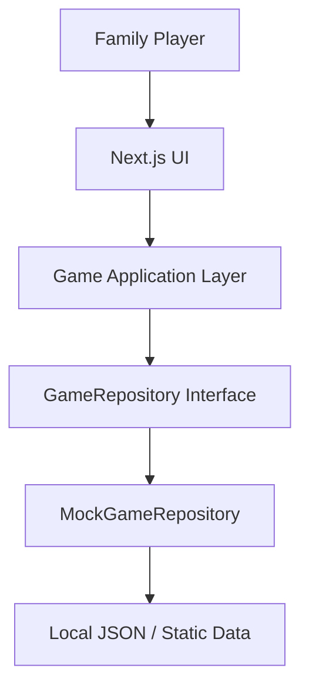
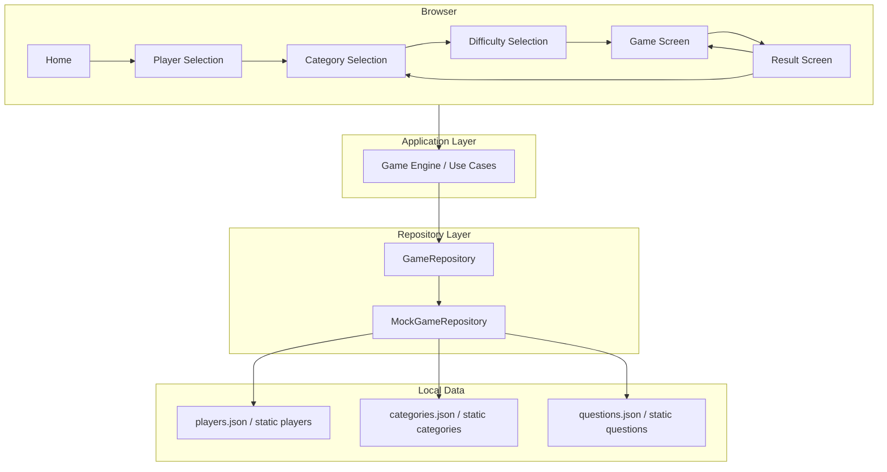
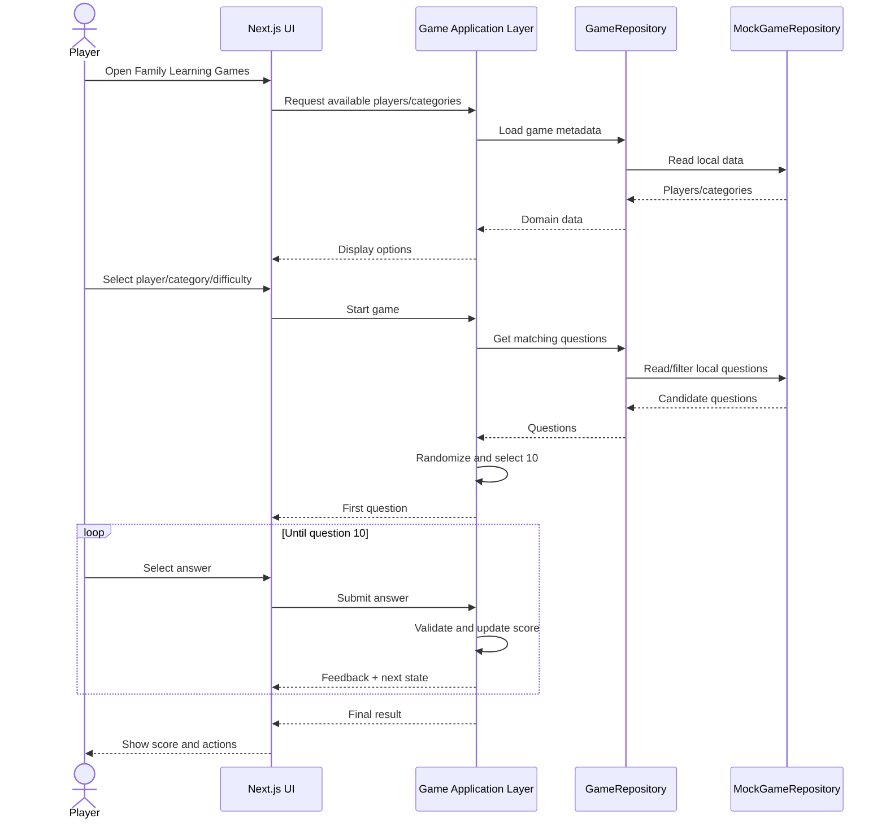

# Family Learning Games — Architecture v0.1

## 1. Document status

- **Version:** v0.1
- **Status:** Current
- **Architecture stage:** Local playable MVP
- **Project:** Family Learning Games
- **Last updated:** 2026-08-31

---

## 2. Purpose

This document describes the architecture of **Family Learning Games v0.1**.

The purpose of this version is deliberately limited:

> Allow a family member to select a player, choose a learning category and difficulty, complete a full 10-question game, and view the result.

v0.1 is intended to validate the product experience and the core game loop before introducing cloud infrastructure, persistence, authentication, artificial intelligence, or multiplayer capabilities.

This document represents the **current architecture baseline** for v0.1 and should be used by developers and coding agents as the main reference for structural decisions.

---

## 3. Product goal for v0.1

The expected user flow is:

```text
HOME
  │
  ▼
SELECT PLAYER
  │
  ▼
SELECT CATEGORY / GAME
  │
  ▼
SELECT DIFFICULTY
  │
  ▼
PLAY 10 QUESTIONS
  │
  ▼
RESULT
  │
  ├── PLAY AGAIN
  │
  └── CHOOSE ANOTHER GAME
```

The objective is not to build a complete educational platform yet.

The objective is to have a small but complete product that can be played locally from start to finish.

---

## 4. Architectural principles

The following principles apply to v0.1.

### 4.1 Keep the implementation intentionally small

Do not introduce infrastructure or abstractions that are not required for the current MVP.

### 4.2 Separate UI from data access

The UI must not depend directly on local JSON files.

Game data should be accessed through a repository abstraction so that the source can later be replaced by a backend API without rewriting the application flow.

### 4.3 Design for evolution, not premature scale

The architecture should make future migration possible without implementing future phases early.

Examples of future capabilities include:

- AWS backend
- persistence
- authentication
- player profiles
- AI-generated questions
- images and audio
- multiplayer
- achievements
- parental controls

These capabilities are explicitly outside v0.1.

### 4.4 Prefer simple domain models

Business concepts such as Player, Category, Difficulty, Game, Question, Answer, GameSession and Result should be represented explicitly in the codebase.

### 4.5 Avoid framework leakage into the domain

Core game rules should remain independent from UI rendering details whenever practical.

---

## 5. Technology baseline

The application is implemented as a web application using:

- **Next.js**
- **React**
- **TypeScript**
- Local/static game data
- Browser-based execution

The application runs locally during v0.1.

Example:

```text
http://localhost:3000
```

No cloud environment is required to complete v0.1.

---

## 6. High-level architecture



### Responsibility overview

```text
Next.js UI
   │
   ▼
Application / Game Use Cases
   │
   ▼
GameRepository
   │
   ▼
MockGameRepository
   │
   ▼
Local JSON / static data
```

---

## 7. Logical architecture

The v0.1 architecture is divided into four logical areas.

```text
┌─────────────────────────────────────────────┐
│                  UI Layer                   │
│                                             │
│ Home                                        │
│ Player Selection                            │
│ Category/Game Selection                     │
│ Difficulty Selection                        │
│ Game Screen                                 │
│ Result Screen                               │
└──────────────────────┬──────────────────────┘
                       │
                       ▼
┌─────────────────────────────────────────────┐
│          Application / Game Layer           │
│                                             │
│ Start game                                  │
│ Select questions                            │
│ Randomize questions                         │
│ Validate answers                            │
│ Track score                                 │
│ Advance question                            │
│ Complete game                               │
│ Build result                                │
└──────────────────────┬──────────────────────┘
                       │
                       ▼
┌─────────────────────────────────────────────┐
│              Repository Layer               │
│                                             │
│ GameRepository                              │
└──────────────────────┬──────────────────────┘
                       │
                       ▼
┌─────────────────────────────────────────────┐
│               Data Layer                    │
│                                             │
│ MockGameRepository                          │
│ Local JSON / static data                    │
└─────────────────────────────────────────────┘
```

---

## 8. UI responsibilities

The UI layer is responsible for rendering and user interaction only.

Expected screens or views include:

### 8.1 Home

Purpose:

- introduce Family Learning Games
- allow the user to begin a game flow
- display available learning games/categories

### 8.2 Player selection

Purpose:

- identify who is playing
- provide a simple family-oriented experience

Example players:

```text
👧 Amelia
👦 Joaquín
👨 Papá
👩 Mamá
```

The selected player is part of the current game session.

No persistent player profile is required in v0.1.

### 8.3 Category or game selection

Purpose:

- allow the player to select what they want to learn or play

Initial categories may include:

```text
🐼 Animals
🚀 Space
🔢 Numbers
```

Additional categories may exist if they remain local and do not introduce new architectural dependencies.

### 8.4 Difficulty selection

Supported difficulty values:

```text
EASY
NORMAL
HARD
```

Suggested presentation:

```text
🌱 Easy
⭐ Normal
🚀 Hard
```

Difficulty influences the pool of questions selected for the game.

### 8.5 Game screen

Responsibilities:

- display the current question
- display answer options
- accept one answer
- indicate whether the answer was correct or incorrect
- update score
- display game progress
- advance to the next question

Example:

```text
Question 2 of 10                     ⭐ 2 points

What color do we usually use to draw the sun?

[ Yellow ]     [ Purple ]
[ Black  ]     [ Pink   ]

Correct! Great job.

[ Next question ]
```

### 8.6 Result screen

Responsibilities:

- show the final score
- personalize the message with the selected player when available
- allow replay
- allow returning to game selection

Example:

```text
🏆 Game completed!

Great job, Amelia!

You answered 8 of 10 questions correctly.

[ Play again ]
[ Choose another game ]
```

---

## 9. Application layer responsibilities

The application layer contains the game orchestration logic.

It should not be responsible for visual styling or direct file access.

Expected responsibilities include:

- load available players
- load available categories/games
- load available difficulty levels
- obtain candidate questions
- select 10 questions for a game
- randomize question order
- optionally randomize answer order
- start a game session
- register an answer
- determine correctness
- increment score
- advance to the next question
- determine when the game is complete
- calculate final result
- restart a game

Possible application concepts may include:

```text
GameService
GameSession
GameEngine
GameUseCases
```

The exact naming is implementation-specific, but the responsibilities should remain separated from the UI and repository implementation.

---

## 10. Repository abstraction

v0.1 uses a repository abstraction for game data.

Conceptually:

```ts
interface GameRepository {
  getPlayers(): Promise<Player[]>;
  getCategories(): Promise<Category[]>;
  getQuestions(criteria: QuestionCriteria): Promise<Question[]>;
}
```

The actual interface may differ based on the current codebase, but it should preserve the same architectural intent:

> Consumers request domain data from a repository and do not know whether that data comes from JSON, an HTTP API, DynamoDB, or another source.

---

## 11. MockGameRepository

The current repository implementation is local.

```text
GameRepository
      │
      ▼
MockGameRepository
      │
      ▼
Local JSON / static data
```

Responsibilities:

- load local game data
- map raw data into application/domain structures if required
- filter questions by category
- filter questions by difficulty
- return available players/categories

It must not contain UI logic.

It should also avoid embedding game-session behavior such as score tracking or navigation.

---

## 12. Local data model

The exact JSON layout may evolve during v0.1, but the conceptual model should include the following entities.

### 12.1 Player

```ts
interface Player {
  id: string;
  name: string;
  avatar?: string;
}
```

Optional future fields must not be implemented unless needed.

Potential future evolution:

```ts
age?: number;
preferences?: string[];
progress?: PlayerProgress;
achievements?: Achievement[];
```

These fields are intentionally outside v0.1 persistence.

### 12.2 Category

```ts
interface Category {
  id: string;
  name: string;
  description?: string;
  icon?: string;
}
```

Example:

```json
{
  "id": "animals",
  "name": "Animals",
  "description": "Learn about animals while playing.",
  "icon": "🐼"
}
```

### 12.3 Difficulty

```ts
type Difficulty = "easy" | "normal" | "hard";
```

### 12.4 Answer

```ts
interface Answer {
  id: string;
  text: string;
  isCorrect: boolean;
}
```

### 12.5 Question

```ts
interface Question {
  id: string;
  categoryId: string;
  difficulty: Difficulty;
  text: string;
  image?: string;
  answers: Answer[];
}
```

The optional `image` field exists so that questions can support child-friendly visual content without requiring an architectural change later.

During v0.1, `image` may reference:

- emoji
- local static image
- `/public` asset

No remote image service is required.

### 12.6 Game session

A game session exists only in application/browser state for v0.1.

Conceptually:

```ts
interface GameSession {
  player: Player;
  category: Category;
  difficulty: Difficulty;
  questions: Question[];
  currentQuestionIndex: number;
  score: number;
  answers: PlayerAnswer[];
  status: "playing" | "completed";
}
```

No session persistence is required.

Refreshing the page may reset the game during v0.1.

---

## 13. Question selection rules

A complete game contains:

```text
10 questions
```

The expected selection process is:

```text
Selected category
      +
Selected difficulty
      │
      ▼
Available question pool
      │
      ▼
Randomize
      │
      ▼
Select 10
      │
      ▼
Start game
```

The local dataset should ideally contain more questions than are displayed in one game to allow replayability.

Example:

```text
20 available questions
         ↓
random selection
         ↓
10 questions per game
```

If a category/difficulty combination temporarily contains exactly 10 questions during development, that is acceptable for v0.1.

---

## 14. Scoring rules

The scoring model for v0.1 should remain simple.

Suggested rule:

```text
Correct answer = +1 point
Incorrect answer = +0 points
Maximum score = 10
```

The UI may display the score as stars or points.

Example:

```text
⭐ 7 points
```

No weighting, streak multiplier, timer bonus, leaderboard or persistent score system is required in v0.1.

---

## 15. Feedback rules

Each answered question should provide immediate feedback.

Example positive feedback:

```text
Correct! Great job.
```

Example negative feedback:

```text
Almost! The correct answer is Elephant.
```

The tone should remain encouraging and appropriate for young children.

Feedback content is local/static in v0.1.

---

## 16. State management

Game state should remain local to the application.

Acceptable mechanisms include:

- React component state
- React Context
- lightweight application-level state

A global state library should not be introduced unless the current implementation demonstrates a concrete need.

v0.1 does not require:

- Redux
- Zustand
- server-side session state
- database-backed state

unless explicitly approved by a later architectural decision.

---

## 17. Routing and navigation

Navigation should support the complete game flow.

Possible routes may include:

```text
/
/play
/result
```

or more explicit routes such as:

```text
/
/players
/games
/games/:gameId
/play/:gameId
/result
```

The exact route structure is not architecturally mandated for v0.1.

However, navigation must support:

- returning to games
- restarting the same game
- selecting another game
- completing a game without invalid state transitions

---

## 18. Error and empty states

v0.1 should handle expected local failures gracefully.

Examples:

### No questions available

```text
No questions are available for this category and difficulty yet.
```

### Invalid game/category

The application should return the user to a valid selection screen rather than crashing.

### Insufficient questions

The application may:

1. use the available questions, or
2. prevent the game from starting with a clear message.

The chosen behavior should be deterministic and testable.

---

## 19. Responsive design

Family Learning Games is a web application and v0.1 should work reasonably on:

- desktop browser
- tablet browser
- mobile browser

The primary development experience may remain desktop-first, but the game UI should not depend on a fixed desktop width.

Important elements should remain touch-friendly:

- answer buttons
- game selection cards
- player cards
- difficulty options
- next-question button

This does not yet make the application a native mobile application.

---

## 20. Accessibility baseline

v0.1 should maintain basic accessibility practices.

Recommended baseline:

- use semantic HTML elements
- keep buttons keyboard accessible
- avoid conveying correctness only through color
- maintain readable contrast
- add `alt` text for meaningful images
- keep tap/click targets sufficiently large

Full WCAG certification is not part of v0.1.

---

## 21. Testing strategy

v0.1 should include enough automated testing to protect the game loop.

Priority should be given to behavior rather than visual implementation details.

Recommended tests:

### Unit tests

- question filtering by category
- question filtering by difficulty
- question random selection
- answer validation
- score calculation
- game completion

### Component/integration tests

- select player
- select category
- select difficulty
- answer a question
- display feedback
- advance to next question
- complete game
- display result
- restart game

### End-to-end critical flow

The most important scenario is:

```text
Open application
   ↓
Select player
   ↓
Select category
   ↓
Select difficulty
   ↓
Complete 10 questions
   ↓
View final result
```

A single reliable end-to-end happy path provides high value for v0.1.

---

## 22. Out of scope for v0.1

The following capabilities must not be introduced as part of v0.1 unless explicitly approved:

```text
AWS infrastructure
API Gateway
Lambda
DynamoDB
RDS / PostgreSQL
S3-based dynamic content
Cognito
Authentication
User registration
Persistent player profiles
Cloud persistence
AI question generation
Amazon Bedrock
OpenAI integration
External image generation
Audio generation
Speech recognition
Multiplayer
Realtime WebSocket communication
Global leaderboards
Social features
Subscriptions
Payments
Admin portal
Content management system
Push notifications
Analytics platform
Complex observability stack
```

The absence of these components is intentional.

---

## 23. Deployment for v0.1

The architectural baseline for v0.1 is local execution.

```text
Developer machine
      │
      ▼
Next.js development server
      │
      ▼
Browser
```

Typical execution:

```bash
npm run dev
```

followed by:

```text
http://localhost:3000
```

Public AWS deployment belongs to a later phase unless the roadmap is explicitly changed.

---

## 24. Expected v0.1 component diagram



---

## 25. Expected runtime flow



---

## 26. Evolution path

v0.1 intentionally introduces the repository boundary because it is expected to evolve later.

### Current

```text
Next.js
   │
   ▼
Application Layer
   │
   ▼
GameRepository
   │
   ▼
MockGameRepository
   │
   ▼
Local JSON
```

### Expected future backend evolution

```text
Next.js
   │
   ▼
Application Layer
   │
   ▼
GameRepository
   │
   ▼
ApiGameRepository
   │
   ▼
AWS API
```

The UI and core game flow should require minimal changes when this replacement happens.

---

## 27. Anticipated future architecture phases

These phases are informational and do not authorize implementation during v0.1.

### Future phase: Backend serverless

Possible evolution:

```text
Next.js
   │
   ▼
API Gateway
   │
   ▼
Lambda
```

### Future phase: Persistence

Possible evolution:

```text
Lambda
   │
   ▼
DynamoDB
```

### Future phase: AI-generated content

Possible evolution:

```text
Game Backend
   │
   ▼
AI Generation Service
   │
   ▼
Amazon Bedrock / approved provider
```

### Future phase: family profiles

Possible future concepts:

```text
Family
 ├── Parent
 ├── Child
 ├── Preferences
 ├── Progress
 └── Achievements
```

These concepts must be documented in future architecture versions and/or ADRs before implementation if they materially change the system.

---

## 28. Architecture versioning rules

Architecture documents should be versioned rather than overwritten when a meaningful structural change occurs.

Example:

```text
docs/architecture/
├── ARCHITECTURE-v0.1.md
├── ARCHITECTURE-v0.2.md
├── ARCHITECTURE-v0.3.md
├── ADR-001.md
├── ADR-002.md
└── ...
```

Create a new architecture version when changes materially alter system structure, such as:

- introducing a backend
- introducing cloud infrastructure
- replacing local storage with persistent storage
- introducing authentication
- introducing asynchronous processing
- introducing external AI services
- introducing realtime multiplayer

Small UI changes do not require a new architecture version.

---

## 29. ADR relationship

Architecture documents describe **what the system architecture is**.

Architecture Decision Records describe **why an important decision was made**.

Example:

```text
ARCHITECTURE-v0.1.md
        │
        ├── ADR-001
        │     Why Next.js?
        │
        └── ADR-002
              Why repository abstraction?
```

Future examples:

```text
ARCHITECTURE-v0.2.md
        │
        └── ADR-003
              Why AWS serverless?
```

```text
ARCHITECTURE-v0.3.md
        │
        └── ADR-004
              Why DynamoDB?
```

---

## 30. Rules for coding agents

Coding agents working on the repository should respect this architecture baseline.

Before introducing structural changes, agents should review:

```text
AGENTS.md
docs/architecture/ARCHITECTURE-v0.1.md
docs/architecture/ADR-*.md
```

Agents should not introduce new infrastructure, frameworks or external services only because they may be useful later.

Examples of changes that should not be introduced automatically:

```text
PostgreSQL
Prisma
Redis
DynamoDB
AWS CDK
Terraform
Cognito
Redux
Zustand
GraphQL
WebSockets
Bedrock
OpenAI APIs
```

Any such addition should be justified by the current product requirement and, when architecturally significant, documented through a new ADR and/or architecture version.

---

## 31. Definition of Done for Architecture v0.1

Architecture v0.1 can be considered implemented when the application supports the following complete local flow:

```text
1. Open Family Learning Games
2. Select a player
3. Select a category/game
4. Select a difficulty
5. Start a game
6. Receive 10 questions
7. Answer each question
8. Receive immediate feedback
9. Track score/progress
10. Complete the game
11. View final result
12. Play again or choose another game
```

Additionally:

- game data is obtained through the repository abstraction
- local data is provided by `MockGameRepository` or equivalent
- the UI does not directly depend on JSON files
- no backend is required
- no persistent database is required
- no authentication is required
- the critical game loop has basic automated test coverage
- the application is reasonably usable on desktop and touch-sized screens

---

## 32. Explicit architectural boundary

The key architectural boundary for v0.1 is:

```text
                 CURRENT SCOPE

┌──────────────────────────────────────────┐
│               Next.js App                │
│                                          │
│ UI                                       │
│ Game logic                               │
│ Repository abstraction                   │
│ MockGameRepository                       │
│ Local game data                          │
└──────────────────────────────────────────┘

──────────────── v0.1 boundary ────────────────

                 FUTURE SCOPE

AWS
Authentication
Persistence
AI
Multiplayer
Analytics
Cloud deployment
```

Anything below the v0.1 boundary should be treated as future architecture unless explicitly requested.

---

## 33. Summary

Family Learning Games v0.1 is intentionally a **local-first playable MVP**.

Its architecture can be summarized as:

```text
Family Player
      │
      ▼
Next.js UI
      │
      ▼
Game Application Logic
      │
      ▼
GameRepository
      │
      ▼
MockGameRepository
      │
      ▼
Local Data
```

The most important architectural decision is not the local JSON itself, but the separation between the application and the data source.

That boundary allows the project to remain small today while preserving a clean path toward:

```text
Local MVP
   ↓
AWS backend
   ↓
Persistence
   ↓
AI-generated learning content
   ↓
Family profiles
   ↓
Multiplayer and richer game modes
```

v0.1 should remain focused on one outcome:

> A family can sit together, choose who is playing, choose what to learn, complete a 10-question game, and enjoy the result from start to finish.
