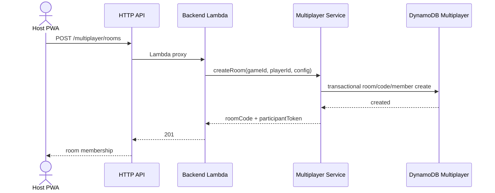
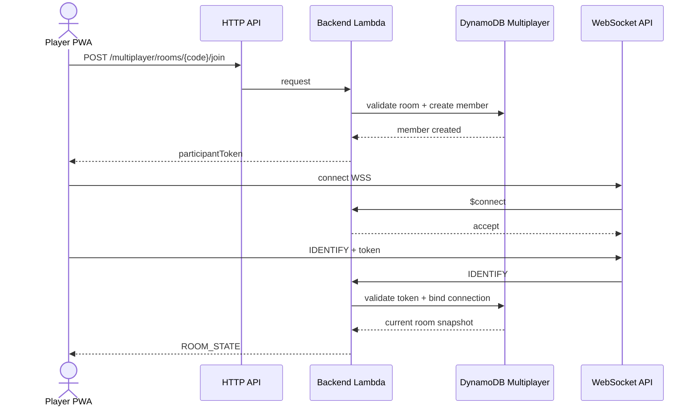
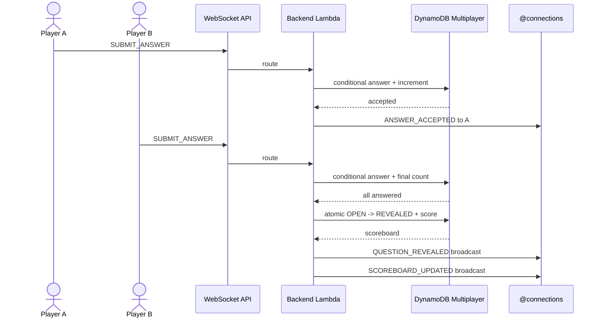
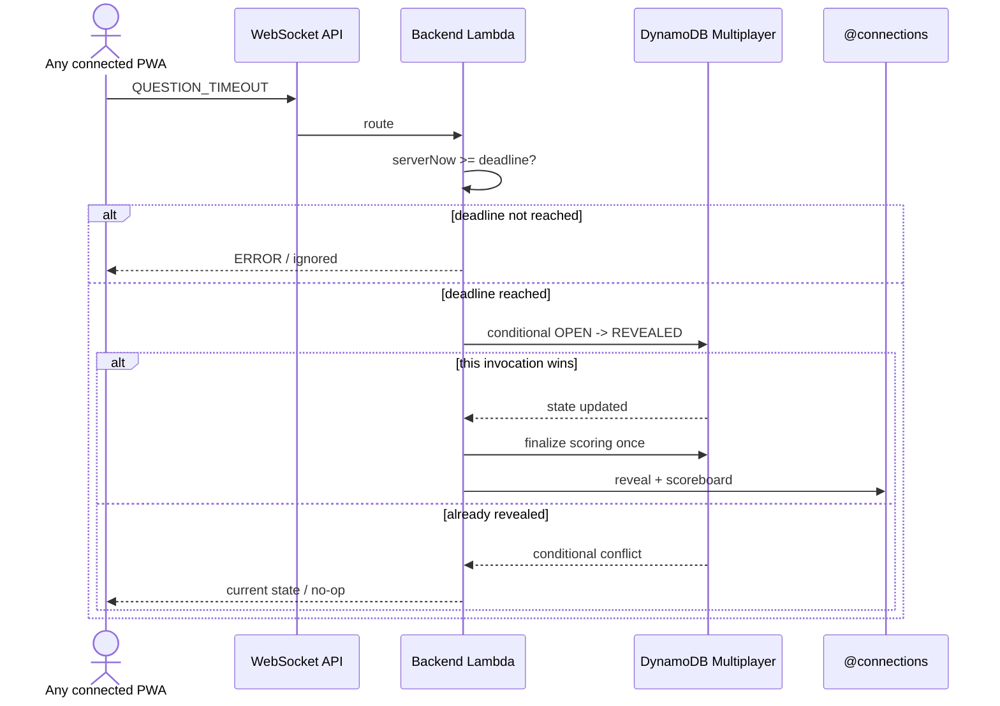

# Family Learning Games — Architecture v0.9

## 1. Purpose

This document defines the target architecture for **FASE 9 — Multiplayer / v0.9**.

v0.9 adds real-time multiplayer quiz rooms while preserving the serverless architecture and the existing v0.8 capabilities.

The design intentionally avoids authentication platforms, AppSync, Redis, containers, and additional gameplay Lambdas.

---

## 2. Architectural goals

The architecture MUST:

- support several devices in the same quiz room;
- synchronize room/question/score state in real time;
- keep the backend authoritative;
- preserve one existing backend Lambda;
- preserve the existing HTTP API;
- preserve existing single-player behavior;
- reuse existing `Game` and `Player` concepts;
- isolate ephemeral multiplayer coordination from single-player `GameSessions`;
- scale naturally through managed AWS services;
- remain simple enough for a family-scale application.

---

## 3. Existing v0.8 baseline

```text
GitHub
   ↓
AWS Amplify Hosting
   ↓
Browser / Installed PWA
   ↓
Next.js
   ↓
GameApiClient
   ↓
API Gateway HTTP API
   ↓
family-learning-games-backend Lambda
   ↓
Application
   ├── Game / Player / GameSession services
   ├── AI generation / validation ports
   └── Media ports
   ↓
Infrastructure adapters
   ├── DynamoDB
   ├── Amazon Bedrock
   ├── Amazon S3
   └── Amazon Polly
```

v0.9 extends this architecture; it does not replace it.

---

## 4. Target v0.9 architecture

```text
                                   ┌─────────────────────────────┐
                                   │ AWS Amplify Hosting         │
                                   │ play.joamgames.com          │
                                   └──────────────┬──────────────┘
                                                  │
                                  Browser / Installed PWA
                                                  │
                     ┌────────────────────────────┴───────────────────────────┐
                     │                                                        │
                     │ HTTPS                                                  │ WSS
                     ▼                                                        ▼
          ┌───────────────────────┐                               ┌───────────────────────┐
          │ API Gateway HTTP API  │                               │ API Gateway WebSocket │
          │ existing API          │                               │ API — new in v0.9     │
          └───────────┬───────────┘                               └───────────┬───────────┘
                      │                                                       │
                      └──────────────────────────┬────────────────────────────┘
                                                 ▼
                              ┌─────────────────────────────────┐
                              │ family-learning-games-backend   │
                              │ AWS Lambda — existing           │
                              └────────────────┬────────────────┘
                                               │
                  ┌────────────────────────────┼─────────────────────────────┐
                  │                            │                             │
                  ▼                            ▼                             ▼
        Existing Application           Multiplayer Application       WebSocket Broadcaster
        services                       services                      port
                  │                            │                             │
         ┌────────┼────────┐                   │                             │
         │        │        │                   ▼                             │
         ▼        ▼        ▼          ┌───────────────────────┐              │
      Games   Players  GameSessions   │ DynamoDB Multiplayer  │              │
      table    table      table       │ table — new           │              │
                                     └───────────────────────┘              │
                                                                            ▼
                                                            API Gateway Management API
                                                            postToConnection
```

Existing Bedrock, S3, and Polly paths remain unchanged and are omitted above for readability.

---

## 5. Why a WebSocket API

Multiplayer needs server → client events without polling:

```text
player joined
game started
question opened
question revealed
scoreboard changed
game finished
```

API Gateway WebSocket APIs provide bidirectional connections while allowing the backend to remain Lambda-based.

v0.9 therefore adds:

```text
API Gateway WebSocket API
```

It does NOT replace the existing HTTP API.

---

## 6. HTTP versus WebSocket responsibilities

### HTTP API

Use the existing HTTP API for request/response operations that bootstrap multiplayer:

```text
POST /multiplayer/rooms                  { gameId, playerId, questionTimeLimitSeconds?, difficulty? }
POST /multiplayer/rooms/{roomCode}/join  { playerId }
```

Reasons:

- easy form submission;
- clear validation/error semantics;
- no need to open a socket before room membership exists;
- room membership token can be returned directly over HTTPS.

### WebSocket API

Use WebSockets after room membership exists:

```text
IDENTIFY
START_GAME
SUBMIT_ANSWER
QUESTION_TIMEOUT
NEXT_QUESTION
SYNC_ROOM
```

and server events:

```text
ROOM_STATE
PLAYER_JOINED
PLAYER_DISCONNECTED
GAME_STARTED
QUESTION_OPENED
ANSWER_ACCEPTED
QUESTION_REVEALED
SCOREBOARD_UPDATED
GAME_FINISHED
ERROR
```

---

## 7. One backend Lambda

v0.9 preserves:

```text
family-learning-games-backend
```

as the single backend Lambda.

Both APIs integrate with the same Lambda.

The interface layer distinguishes:

```text
HTTP API Gateway v2 events
WebSocket API Gateway v2 events
```

and delegates to separate routers/adapters.

Recommended structure:

```text
src/
  interfaces/
    http/
      lambda.ts
      router.ts
    websocket/
      websocketRouter.ts
      websocketContracts.ts
      websocketResponses.ts

  application/
    multiplayer/
      MultiplayerRoomService.ts
      MultiplayerGameplayService.ts
      MultiplayerScoringService.ts
      MultiplayerBroadcaster.ts
      contracts.ts

  domain/
    multiplayer/
      multiplayerRoom.ts
      multiplayerScore.ts

  infrastructure/
    multiplayer/
      DynamoDbMultiplayerRepository.ts
      ApiGatewayWebSocketBroadcaster.ts
```

The exact filenames may follow the repository's existing conventions.

---

## 8. Domain boundaries

### Domain remains AWS-independent

`src/domain` MUST NOT import:

```text
AWS SDK
API Gateway
Lambda
DynamoDB
CDK
```

Recommended domain concepts:

```text
MultiplayerRoom
MultiplayerRoomStatus
MultiplayerQuestionState
MultiplayerMember
MultiplayerRole
MultiplayerAnswer
MultiplayerScore
```

### Application remains provider-independent

Application depends on ports such as:

```text
MultiplayerRepository
MultiplayerBroadcaster
TokenHasher / TokenGenerator
Clock
IdGenerator
RoomCodeGenerator
```

It MUST NOT construct AWS SDK clients.

### Infrastructure owns AWS details

Infrastructure owns:

- DynamoDB keys/items;
- DynamoDB transactions and conditional expressions;
- API Gateway Management API client;
- WebSocket callback endpoint;
- AWS errors such as stale/gone connections.

---

## 9. Multiplayer persistence decision

v0.9 introduces one new DynamoDB table dedicated to ephemeral multiplayer coordination.

Recommended physical name:

```text
<env>-family-learning-games-multiplayer
```

This avoids forcing real-time connection records and concurrent answer records into the existing single-player `GameSessions` model.

Existing tables remain:

```text
Games
GameSessions
Players
```

---

## 10. Multiplayer table access model

Recommended keys:

```text
PK
SK
```

Recommended item patterns:

### Room metadata

```text
PK = ROOM#<roomId>
SK = META
```

Fields include:

```text
roomId
roomCode
gameId
hostPlayerId
status
questionState
currentQuestionIndex
questionStartedAt
questionDeadlineAt
answeredCount
roomVersion
createdAt
expiresAt
```

### Player membership

```text
PK = ROOM#<roomId>
SK = PLAYER#<playerId>
```

Fields include:

```text
playerId
role
participantTokenHash
connectionId?
joinedAt
connectionStatus
correctAnswers
totalPoints
firstPlaceCorrectAnswers
secondPlaceCorrectAnswers
thirdPlaceCorrectAnswers
cumulativeCorrectResponseTimeMs
expiresAt
```

The display name may be resolved from `Players` or kept as a safe room snapshot if needed for efficient broadcasts.

### Answer

```text
PK = ROOM#<roomId>
SK = ANSWER#<questionId>#<playerId>
```

Fields include:

```text
questionId
playerId
answerId
serverReceivedAtMs
responseDurationMs
isCorrect
placement?
pointsAwarded?
expiresAt
```

### Connection reverse lookup

```text
PK = CONNECTION#<connectionId>
SK = META
```

Fields:

```text
roomId
playerId
connectedAt
expiresAt
```

This lets `$disconnect` resolve a connection without scanning room partitions.

---

## 11. Room-code lookup (reservation item)

Room codes resolve through a dedicated reservation item in the same table. No GSI is used.

```text
PK = CODE#<roomCode>
SK = RESERVATION
roomId, roomCode, expiresAt
```

The join endpoint and `IDENTIFY` perform:

```text
roomCode
   ↓
GetItem CODE#<roomCode> / RESERVATION   (strongly consistent)
   ↓
roomId
   ↓
room/member operations
```

The same item is the uniqueness constraint (§13), so one key read gives a consistent lookup immediately after creation, with no eventually consistent index. No table scan is permitted for room lookup.

---

## 12. TTL strategy

Multiplayer records are ephemeral.

Enable DynamoDB TTL on:

```text
expiresAt
```

Recommended room lifetime:

```text
2 hours
```

The exact TTL is configuration, not Domain policy.

Application logic MUST still reject expired rooms based on authoritative timestamps. DynamoDB TTL is cleanup, not the only expiration check.

---

## 13. Room creation concurrency

Room codes are short, so collisions are possible.

Creation algorithm:

```text
generate roomId
generate roomCode
TransactWriteItems:
  Put CODE#<roomCode>/RESERVATION   IF attribute_not_exists(PK) OR expiresAt <= now
  Put ROOM#<roomId>/META            IF attribute_not_exists(PK)
  Put ROOM#<roomId>/PLAYER#<host>   IF attribute_not_exists(PK)
        │
        ├─ success → return
        │
        └─ code collision → generate new code and retry
```

Retries are bounded (5 attempts). A reservation whose room already expired may be reused before DynamoDB TTL deletes it.

---

## 14. Room membership security

No Cognito is added.

The backend creates an opaque room membership token on create/join.

Conceptually:

```text
participantToken = secureRandom(>=128 bits)
storedValue       = hash(participantToken)
```

The token is bound to:

```text
roomId
playerId
role
expiry
```

The raw token is returned once to the browser and is never persisted by the backend.

The room code is not authorization.

---

## 15. WebSocket identification

### `$connect`

`$connect` validates basic transport policy such as allowed `Origin`.

It does not need the room token in the URL.

The connection starts as unidentified.

### `IDENTIFY`

First application message:

```json
{
  "action": "IDENTIFY",
  "roomCode": "AB7K2M",
  "playerId": "player-id",
  "participantToken": "opaque-value"
}
```

Application flow:

```text
Resolve roomCode
    ↓
Load membership
    ↓
Hash presented token
    ↓
Constant-time comparison
    ↓
Validate room not expired
    ↓
Bind connectionId to membership
    ↓
Persist reverse connection mapping
    ↓
Return ROOM_STATE
```

Gameplay actions from an unidentified connection are rejected.

---

## 16. Why the token is not in the WebSocket URL

Browser WebSocket APIs do not provide a general mechanism for arbitrary custom authorization headers.

A token in a query string can be exposed to infrastructure/request logs more easily.

v0.9 therefore prefers:

```text
connect WSS
    ↓
send IDENTIFY as first application message
```

over:

```text
wss://.../?token=<secret>
```

The transport remains encrypted by WSS.

---

## 17. WebSocket routing

Recommended route selection expression:

```text
$request.body.action
```

Infrastructure routes may include:

```text
$connect
$disconnect
$default
IDENTIFY
START_GAME
SUBMIT_ANSWER
QUESTION_TIMEOUT
NEXT_QUESTION
SYNC_ROOM
```

Multiple WebSocket routes can integrate with the same Lambda.

---

## 18. Broadcasting

Application defines a provider-independent port:

```ts
interface MultiplayerBroadcaster {
  send(connectionId: string, event: MultiplayerServerEvent): Promise<void>;
}
```

Infrastructure implementation:

```text
ApiGatewayWebSocketBroadcaster
        ↓
API Gateway Management API
        ↓
postToConnection
```

For a room broadcast:

```text
query room members/connections
        ↓
send event to active connectionIds
        ↓
if connection is stale:
    remove/mark stale mapping
```

A single failed connection MUST NOT fail the broadcast to all other players.

---

## 19. `$disconnect` behavior

API Gateway `$disconnect` delivery is best-effort.

Therefore:

- process `$disconnect` when received;
- remove/update the connection mapping idempotently;
- never depend on `$disconnect` as the only cleanup mechanism;
- handle stale connection errors during broadcast;
- expire old connection records using TTL.

Disconnecting does not remove room membership in v0.9.

---

## 20. Reconnect model

A member can reconnect while its token and room are valid.

The new connection:

```text
IDENTIFY
    ↓
validate membership token
    ↓
replace member.connectionId
    ↓
write new CONNECTION reverse record
    ↓
optionally close/ignore old connection
    ↓
return ROOM_STATE
```

Latest validated connection wins.

This supports:

- mobile network changes;
- browser refresh;
- brief Wi-Fi loss.

Host migration is not included.

### Accepted limitation (token loss)

The participant token is kept only in the tab's `sessionStorage` (ADR-020), never in `localStorage`, IndexedDB or a persistent cookie. Multiplayer reconnection is supported while the ephemeral participant token remains available in the browser session. If the browser/PWA session is fully terminated and the token is lost, the participant cannot securely reclaim the existing membership in v0.9 because player profiles are not authenticated identities. There is no recovery based on `roomCode + playerId` and no token-recovery flow. Joining again with the same player is rejected (`PLAYER_ALREADY_JOINED`).

---

## 21. Server-authoritative state machine

Room state:

```text
WAITING
   │ START_GAME
   ▼
IN_PROGRESS
   │ final question revealed
   ▼
FINISHED
```

Question state inside `IN_PROGRESS`:

```text
NOT_STARTED
     │ open question
     ▼
   OPEN
     │ all answered OR deadline validated
     ▼
 REVEALED
     ├─ not the last question: host NEXT_QUESTION ─► OPEN (next question)
     │
     └─ last question: room.status = FINISHED in the same
        atomic reveal write (no NEXT_QUESTION), then GAME_FINISHED
```

`NEXT_QUESTION` after the room is `FINISHED` is rejected with `INVALID_ROOM_STATE`.

Every transition is validated in Application and protected by conditional persistence.

---

## 22. Opening a question

When the backend opens a question:

```text
questionStartedAt = serverNow
questionDeadlineAt = questionStartedAt + configuredLimit
answeredCount = 0
questionState = OPEN
roomVersion++
```

The backend broadcasts:

```text
QUESTION_OPENED
```

The event contains public question data only.

Correctness metadata remains private.

---

## 23. Answer transaction

When `SUBMIT_ANSWER` arrives:

1. resolve connection → room/player;
2. load authoritative room state;
3. validate:
   - room `IN_PROGRESS`;
   - question `OPEN`;
   - `questionId` is current;
   - server time <= deadline;
4. validate answer belongs to question;
5. calculate correctness;
6. write the unique answer;
7. increment `answeredCount`;
8. acknowledge.

The write SHOULD use a DynamoDB transaction/conditional expression so a duplicate answer cannot increment the count twice.

Conceptual invariant:

```text
one answer per (roomId, questionId, playerId)
```

The client cannot replace its accepted answer.

---

## 24. Deadline model

The server owns:

```text
questionStartedAt
questionDeadlineAt
```

The browser owns only the visual countdown.

v0.9 intentionally avoids provisioning a scheduler for every question.

At the deadline, any connected client can send:

```text
QUESTION_TIMEOUT
```

The backend checks:

```text
serverNow >= questionDeadlineAt
AND
questionState == OPEN
```

before attempting closure.

This message is a trigger, not authority.

### Client trigger

The frontend sends `QUESTION_TIMEOUT` automatically, with no user action, when its server-estimated time (local time + the offset from each event's `serverTime`) reaches `questionDeadlineAt`. Each connection sends it once per question, and re-sends only every 3 s while the question is still `OPEN` (for example after an early rejection caused by clock skew or a lost reply). A timeout received before the server deadline is rejected with `INVALID_QUESTION_STATE`. Nothing changes and nothing is scored.

### Recovery on later activity

An overdue question that is still `OPEN` closes itself on the next backend invocation for that room. These commands run the same deadline guard and the same atomic reveal/scoring path before continuing:

```text
IDENTIFY (connect / reconnect)
SYNC_ROOM
SUBMIT_ANSWER   (the late answer is rejected; the guard still closes the question)
QUESTION_TIMEOUT
NEXT_QUESTION   (closes the overdue question, then is rejected until the host sees the reveal)
```

There is exactly one reveal implementation, so concurrent recoveries still produce one `OPEN → REVEALED` transition and one scoring finalization.

### Accepted limitation (event-driven timeout)

API Gateway WebSocket and Lambda are event-driven. If every connected client disappears and no backend invocation occurs after the deadline, the question cannot transition from OPEN to REVEALED until new activity reaches the backend. When activity resumes, the guard above closes it. v0.9 does not add EventBridge Scheduler, Step Functions, cron, extra Lambdas or backend polling for this.

---

## 25. Exactly-once logical reveal

At-least-once client behavior is expected.

Several events may race:

```text
last player's answer
player A timeout trigger
player B timeout trigger
retry
```

The persisted transition must permit only:

```text
OPEN → REVEALED
```

once.

A conditional update/version check determines the winner of the race.

Scoring is attached to that logical transition and MUST be idempotent.

---

## 26. Scoring architecture

Scoring belongs to Domain/Application.

Infrastructure persists the result but does not decide it.

Constants for v0.9:

```text
BASE_CORRECT_POINTS = 1000

SPEED_BONUS:
1st = 300
2nd = 200
3rd = 100
4th+ = 0
```

Only correct answers participate in placement.

Question score:

```text
QUESTION_POINTS =
    isCorrect
      ? 1000 + SPEED_BONUS(correctPlacement)
      : 0
```

Recommended domain function:

```ts
calculateQuestionResults(
  answers: MultiplayerAnswer[],
  tieWindowMs: number
): QuestionResult[]
```

The function:

1. filters correct answers;
2. orders by server receive time;
3. applies the 100 ms tie window (correct answers within 100 ms of the first answer of a group share that group's placement);
4. assigns placement;
5. assigns points;
6. returns deterministic results.

Placement uses competition ranking: tied players share the placement and its bonus, and the next player skips the shared places (`1, 1, 3`). For example, if A and B arrive within `PLACEMENT_TIE_WINDOW_MS`, both are placement 1 (1300 points) and the next correct answer C is placement 3 (1100). Final ranks also use competition ranking: fully equal scores share a rank.

---

## 27. Final ranking architecture

Maintain per-member aggregates:

```text
correctAnswers
totalPoints
firstPlaceCorrectAnswers
secondPlaceCorrectAnswers
thirdPlaceCorrectAnswers
cumulativeCorrectResponseTimeMs
```

Final comparator:

```text
correctAnswers                    DESC
totalPoints                       DESC
firstPlaceCorrectAnswers          DESC
secondPlaceCorrectAnswers         DESC
thirdPlaceCorrectAnswers          DESC
cumulativeCorrectResponseTimeMs   ASC
```

Identical comparator logic is used for the live podium and final podium.

The backend sends final ranks; clients do not independently decide the winner.

---

## 28. Why correctness is ranked before total points

Speed is valuable, but this is an educational game.

A player with fewer correct answers should not become champion only by guessing rapidly.

Therefore:

```text
accuracy > speed
```

and speed primarily orders players with equal accuracy.

This still lets first/second/third response placement move players on the podium throughout the match.

---

## 29. Versioning room state

Use a numeric:

```text
roomVersion
```

incremented for authoritative room-state transitions.

Events include the current version.

Clients:

- accept events newer than their current version;
- may ignore stale duplicates;
- can request `SYNC_ROOM` if they detect a gap or reconnect.

This reduces UI inconsistency caused by delayed network messages.

---

## 30. `SYNC_ROOM`

`SYNC_ROOM` returns the current safe room snapshot.

It is useful after:

- reconnect;
- app visibility changes;
- suspected event loss;
- stale local version.

Snapshot includes:

```text
room status
question state
current public question, if open/revealed
deadline
members
scoreboard
roomVersion
```

It MUST NOT expose hidden correctness while a question is `OPEN`.

---

## 31. Existing game reuse

Multiplayer references:

```text
gameId
```

and reads the existing persisted `Game`.

Do not create:

```text
MultiplayerGame
MultiplayerQuestion
MultiplayerAnswerOption
```

as parallel copies of the core game model.

A room snapshots the ordered question identifiers required for stable gameplay, but the `Game` remains the content source.

`POST /multiplayer/rooms` accepts an optional `difficulty` using the existing `Difficulty` enum (`easy | normal | hard`). It selects which of the game's questions are played, because seeded games contain all three difficulties. When it is omitted, the game's first available difficulty is used (AI-generated games have exactly one). The room takes up to 10 questions of that difficulty, in persisted order, that have exactly one correct answer. There is no multiplayer-specific difficulty concept.

---

## 32. Existing player reuse

Room members reference existing:

```text
Player.playerId
```

No multiplayer-specific account is created.

Do not change `Player` into a login identity.

Room membership is ephemeral and separate from the persistent player profile.

---

## 33. Existing media reuse

`QUESTION_OPENED` may carry the same public media metadata already supported by the game/session DTOs.

Question audio continues through the existing HTTP endpoint and Polly/S3 cache flow.

The WebSocket MUST NOT transmit audio bytes or S3 objects.

---

## 34. PWA behavior

Multiplayer is online-only.

The Service Worker MUST NOT cache:

```text
WebSocket traffic
multiplayer room state
multiplayer API responses as authoritative state
participant tokens as offline persistence
```

Existing static/offline fallback behavior remains unchanged.

Loss of network means the player is temporarily disconnected from multiplayer.

---

## 35. Security boundaries

```text
Browser
  = untrusted

roomCode
  = non-secret

participantToken
  = temporary room capability

API Gateway WebSocket connectionId
  = transport identifier

Lambda/Application
  = authority

DynamoDB
  = persisted authority
```

Never trust from the browser:

```text
role
score
correctness
placement
response timestamp
room state
question state
deadline
```

---

## 36. WebSocket origin validation

Because a browser can initiate WebSocket connections cross-site, `$connect` SHOULD validate the `Origin` header against configured frontend origins.

Example allowed values:

```text
https://play.joamgames.com
http://localhost:3000   # development only
```

Origins are configuration.

Do not hardcode environment-specific origins in Domain/Application.

---

## 37. IAM

The backend Lambda needs existing permissions plus:

```text
DynamoDB read/write on Multiplayer table
execute-api:ManageConnections on the v0.9 WebSocket API
```

Permissions MUST be scoped to the actual table and WebSocket API ARN as tightly as practical.

The frontend receives no AWS credentials.

---

## 38. Configuration

Recommended configuration:

```text
MULTIPLAYER_TABLE_NAME
MULTIPLAYER_MAX_PLAYERS=8
MULTIPLAYER_ROOM_TTL_MINUTES=120
MULTIPLAYER_DEFAULT_QUESTION_SECONDS=30
MULTIPLAYER_MIN_QUESTION_SECONDS=10
MULTIPLAYER_MAX_QUESTION_SECONDS=120
MULTIPLAYER_PLACEMENT_TIE_WINDOW_MS=100
WEBSOCKET_CALLBACK_ENDPOINT
NEXT_PUBLIC_MULTIPLAYER_WEBSOCKET_URL
```

Names MAY be adjusted to current repository conventions.

Secret values MUST NOT use `NEXT_PUBLIC_*`.

The WebSocket URL itself is public configuration and is not a secret.

---

## 39. CDK additions

v0.9 CDK adds:

```text
1 x API Gateway WebSocket API
1 x WebSocket Stage
WebSocket routes
1 x DynamoDB Multiplayer table
Lambda permissions for table
Lambda permission/integration for WebSocket routes
Lambda IAM permission for ManageConnections
WebSocket URL stack output
Multiplayer table stack output
```

It does not add:

```text
new backend Lambda
Cognito
AppSync
Redis
EventBridge
Step Functions
```

---

## 40. Failure isolation

### Broadcast

A stale player connection does not fail messages to other players.

### DynamoDB concurrency

Conditional failures are translated to domain-safe conflicts:

```text
ANSWER_ALREADY_SUBMITTED
QUESTION_ALREADY_REVEALED
ROOM_ALREADY_STARTED
STALE_ROOM_VERSION
```

### WebSocket protocol

Unknown actions return safe `ERROR` events and do not mutate state.

### Media failure

Existing image/audio failure behavior must not terminate multiplayer gameplay.

---

## 41. Observability

Add structured multiplayer events without secrets.

Example:

```json
{
  "event": "MULTIPLAYER_ANSWER_ACCEPTED",
  "roomId": "room-id",
  "questionId": "question-id",
  "roomVersion": 12,
  "durationMs": 18
}
```

Do not log:

```text
participantToken
participantTokenHash
raw player names
raw answer text
```

Use hashes/redaction where a transport identifier is useful.

---

## 42. Architectural sequence — room creation



---

## 43. Architectural sequence — join + identify



---

## 44. Architectural sequence — answer and reveal



---

## 45. Architectural sequence — timeout



---

## 46. Deployment impact

v0.9 requires a CDK deployment because it adds AWS resources.

Amplify also requires a frontend deployment for the new multiplayer UI and public WebSocket URL.

No destroy/recreate workflow should be required for normal deployment.

Existing DynamoDB tables and media bucket must be preserved.

---

## 47. Decision summary

v0.9 adopts:

```text
HTTP API for room bootstrap
+
API Gateway WebSocket API for real-time gameplay
+
same existing backend Lambda
+
one dedicated DynamoDB Multiplayer table
+
server-authoritative room state and scoring
+
short room code for discovery
+
opaque temporary membership token for room authorization
+
accuracy-first, speed-aware podium
```

See:

- `ADR-018-api-gateway-websocket-multiplayer.md`
- `ADR-019-server-authoritative-multiplayer-state.md`
- `ADR-020-multiplayer-room-membership-and-ephemeral-tokens.md`
